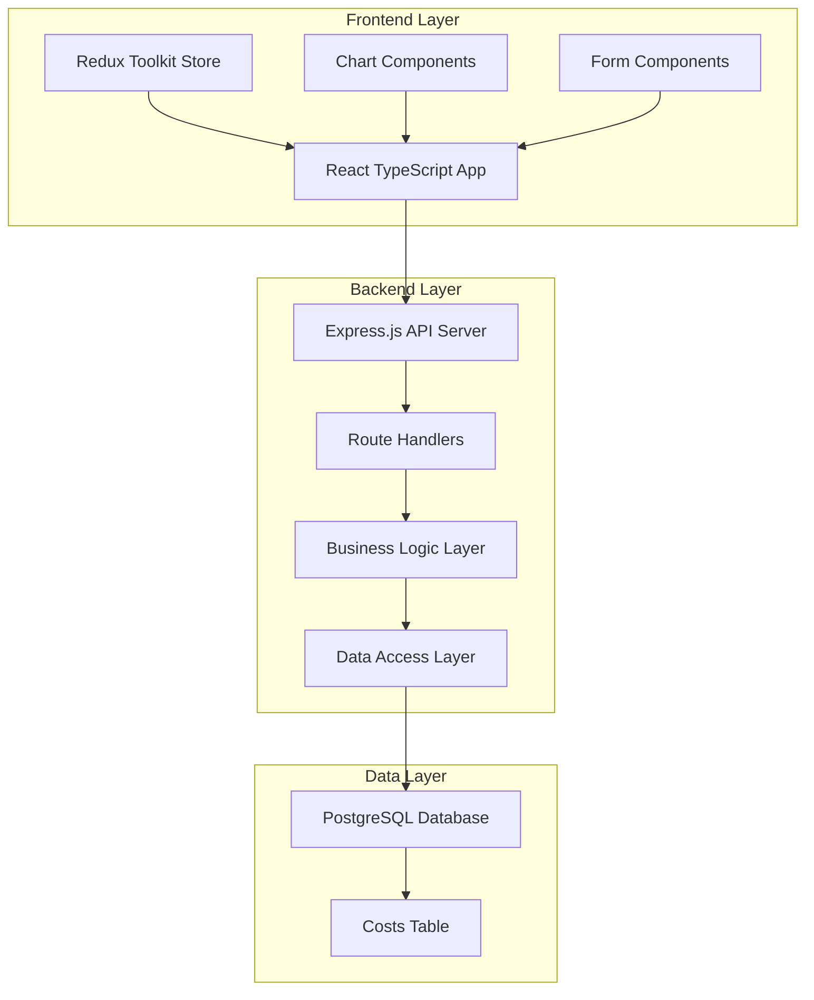

# Design Document

## Overview

The expense management application follows a modern three-tier architecture with a React TypeScript frontend, Node.js Express backend, and PostgreSQL database. The system is designed for scalability, maintainability, and optimal user experience with real-time data visualization capabilities.

## Architecture

### High-Level Architecture



### Technology Stack

**Frontend:**
- React 18+ with TypeScript for type safety
- Redux Toolkit for state management
- React Query for server state management and caching
- Recharts for data visualization
- TailwindCSS for styling
- React Hook Form for form handling

**Backend:**
- Node.js with Express.js framework
- TypeScript for type safety
- Joi for input validation
- Winston for logging
- Helmet for security headers

**Database:**
- PostgreSQL for relational data storage
- Prisma ORM for database operations
- Database migrations for schema management

## Components and Interfaces

### Frontend Components

#### Core Components
```typescript
// Main Layout Component
interface LayoutProps {
  children: React.ReactNode;
}

// Navigation Component
interface NavigationProps {
  currentPath: string;
}

// Dashboard Component
interface DashboardProps {
  selectedMonth?: number;
  selectedYear?: number;
}
```

#### Form Components
```typescript
// Expense Form Component
interface ExpenseFormProps {
  onSubmit: (data: ExpenseFormData) => void;
  initialData?: ExpenseData;
  mode: 'create' | 'edit';
}

interface ExpenseFormData {
  category: ExpenseCategory;
  amount: number;
  month: number;
  year: number;
}
```

#### Chart Components
```typescript
// Bar Chart Component
interface BarChartProps {
  data: ExpenseData[];
  title: string;
  height?: number;
}

// Line Chart Component
interface LineChartProps {
  data: TrendData[];
  title: string;
  height?: number;
}

// Chart Container Component
interface ChartContainerProps {
  loading: boolean;
  error?: string;
  children: React.ReactNode;
}
```

### Backend API Interfaces

#### API Endpoints
```typescript
// Expense Routes
POST   /api/expenses          // Create new expense
GET    /api/expenses          // Get expenses with filters
GET    /api/expenses/:id      // Get specific expense
PUT    /api/expenses/:id      // Update expense
DELETE /api/expenses/:id      // Delete expense
GET    /api/expenses/trends   // Get trend data

// Query Parameters for GET /api/expenses
interface ExpenseQuery {
  year?: number;
  month?: number;
  category?: ExpenseCategory;
  limit?: number;
  offset?: number;
}
```

#### Request/Response Types
```typescript
// Create/Update Expense Request
interface CreateExpenseRequest {
  category: ExpenseCategory;
  amount: number;
  month: number;
  year: number;
}

// Expense Response
interface ExpenseResponse {
  id: number;
  category: ExpenseCategory;
  amount: number;
  month: number;
  year: number;
  createdAt: string;
  updatedAt: string;
}

// Trend Data Response
interface TrendResponse {
  month: number;
  year: number;
  totalAmount: number;
  categoryBreakdown: CategoryAmount[];
}
```

## Data Models

### Database Schema

#### Costs Table
```sql
CREATE TABLE costs (
    id SERIAL PRIMARY KEY,
    category expense_category_enum NOT NULL,
    amount DECIMAL(12,2) NOT NULL CHECK (amount >= 0),
    month INTEGER NOT NULL CHECK (month >= 1 AND month <= 12),
    year INTEGER NOT NULL CHECK (year >= 2020 AND year <= 2050),
    created_at TIMESTAMP WITH TIME ZONE DEFAULT CURRENT_TIMESTAMP,
    updated_at TIMESTAMP WITH TIME ZONE DEFAULT CURRENT_TIMESTAMP,
    
    -- Ensure unique combination of category, month, and year
    UNIQUE(category, month, year)
);

-- Create enum for expense categories
CREATE TYPE expense_category_enum AS ENUM (
    'Salaries',
    'Software & Tools',
    'Infrastructure & Hosting',
    'Hardware & Equipment',
    'Security & Compliance',
    'Operational & Administrative',
    'Continuous Learning & R&D'
);

-- Create indexes for performance
CREATE INDEX idx_costs_year_month ON costs(year, month);
CREATE INDEX idx_costs_category ON costs(category);
CREATE INDEX idx_costs_created_at ON costs(created_at);
```

### TypeScript Data Models

#### Core Types
```typescript
// Expense Category Enum
export enum ExpenseCategory {
  SALARIES = 'Salaries',
  SOFTWARE_TOOLS = 'Software & Tools',
  INFRASTRUCTURE_HOSTING = 'Infrastructure & Hosting',
  HARDWARE_EQUIPMENT = 'Hardware & Equipment',
  SECURITY_COMPLIANCE = 'Security & Compliance',
  OPERATIONAL_ADMINISTRATIVE = 'Operational & Administrative',
  CONTINUOUS_LEARNING_RD = 'Continuous Learning & R&D'
}

// Core Expense Model
export interface ExpenseData {
  id: number;
  category: ExpenseCategory;
  amount: number;
  month: number;
  year: number;
  createdAt: Date;
  updatedAt: Date;
}

// Chart Data Models
export interface CategoryAmount {
  category: ExpenseCategory;
  amount: number;
}

export interface TrendData {
  month: number;
  year: number;
  totalAmount: number;
  categories: CategoryAmount[];
}
```

## Error Handling

### Frontend Error Handling
```typescript
// Error Boundary Component
interface ErrorBoundaryState {
  hasError: boolean;
  error?: Error;
}

// API Error Types
interface ApiError {
  message: string;
  code: string;
  details?: Record<string, any>;
}

// Error Handling Hook
interface UseErrorHandler {
  handleError: (error: Error | ApiError) => void;
  clearError: () => void;
  error: string | null;
}
```

### Backend Error Handling
```typescript
// Custom Error Classes
class ValidationError extends Error {
  constructor(message: string, public field: string) {
    super(message);
    this.name = 'ValidationError';
  }
}

class DuplicateEntryError extends Error {
  constructor(message: string) {
    super(message);
    this.name = 'DuplicateEntryError';
  }
}

// Error Response Format
interface ErrorResponse {
  error: {
    message: string;
    code: string;
    timestamp: string;
    path: string;
  };
}
```

### Error Handling Strategy
1. **Input Validation**: Joi schemas validate all incoming requests
2. **Database Errors**: Catch and transform database constraint violations
3. **API Errors**: Consistent error response format with appropriate HTTP status codes
4. **Frontend Errors**: Error boundaries catch React errors, toast notifications for API errors
5. **Logging**: Winston logger captures all errors with context for debugging

## Testing Strategy

### Frontend Testing
```typescript
// Component Testing with React Testing Library
describe('ExpenseForm', () => {
  it('should validate required fields', () => {
    // Test form validation
  });
  
  it('should prevent duplicate entries', () => {
    // Test duplicate prevention
  });
});

// Integration Testing
describe('Dashboard Integration', () => {
  it('should load and display chart data', () => {
    // Test data loading and chart rendering
  });
});
```

### Backend Testing
```typescript
// Unit Testing with Jest
describe('ExpenseService', () => {
  it('should create expense with valid data', () => {
    // Test expense creation logic
  });
  
  it('should throw error for duplicate entries', () => {
    // Test duplicate prevention
  });
});

// API Integration Testing
describe('Expense API', () => {
  it('POST /api/expenses should create expense', () => {
    // Test API endpoint
  });
});
```

### Testing Approach
1. **Unit Tests**: Test individual components and functions in isolation
2. **Integration Tests**: Test component interactions and API endpoints
3. **E2E Tests**: Test complete user workflows with Cypress
4. **Performance Tests**: Verify chart loading times meet 2-second requirement
5. **Database Tests**: Test data integrity and constraint enforcement

### Performance Considerations

#### Frontend Optimization
- **Code Splitting**: Lazy load chart components and routes
- **Memoization**: Use React.memo for expensive chart components
- **Virtual Scrolling**: For large expense lists
- **Caching**: React Query caches API responses with appropriate stale times

#### Backend Optimization
- **Database Indexing**: Indexes on frequently queried columns (year, month, category)
- **Query Optimization**: Efficient aggregation queries for trend data
- **Response Compression**: Gzip compression for API responses
- **Connection Pooling**: PostgreSQL connection pooling for concurrent requests

#### Database Design
- **Partitioning**: Consider table partitioning by year for large datasets
- **Archiving**: Strategy for archiving old data while maintaining 10-year requirement
- **Backup Strategy**: Regular automated backups with point-in-time recovery

### Security Considerations

#### Input Validation
- Server-side validation for all inputs using Joi schemas
- SQL injection prevention through parameterized queries (Prisma ORM)
- XSS prevention through proper data sanitization

#### API Security
- Rate limiting to prevent abuse
- CORS configuration for allowed origins
- Security headers via Helmet middleware
- Input size limits to prevent DoS attacks

#### Data Protection
- Environment variables for sensitive configuration
- Database connection encryption
- Audit logging for data modifications